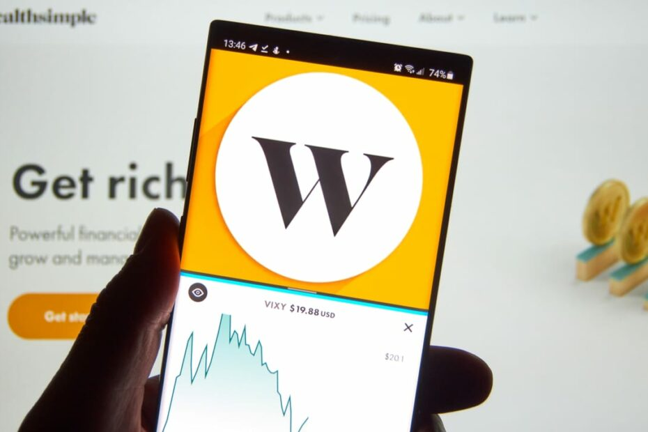

# Wealth Simple – “Investing made easier”

## Best-rated Canadian trading platform!

Wealthsimple is a Toronto-based online trading platform that was started in September 2014. This fast-growing Fintech company was founded by Michael Katchen, Brett Huneycutt and Rudy Adler.

This platform enables users to invest money and create diverse portfolios using exchange-traded funds. There is no minimum investment requirement and costs are lower than typical trading costs to make investing more accessible to millennials. Contrary to many Robo-advisors, Wealthsimple also offers phone, email, text, and video chat access to real advisors.

[link](https://www.wealthsimple.com/en-ca)

## How it started

Michael Katchen developed an Excel model while he was employed by Ancestry.com to provide advice to his coworkers on building investment portfolios. He immediately realized that everyone needed access to smart, straightforward, low-cost investment, which led to the establishment of Wealthsimple in 2014. 

In 2015, Wealthsimple managed $400 million in assets across 10,000 customer accounts after purchasing Canadian ShareOwner Investments Inc., Canada's first Robo-advisor service. A partnership with Mint was established in 2016, allowing customers to sync their investment accounts to Mint's budgeting tool. Wealthsimple for Advisors was also launched in 2016, providing an automated platform for financial advisors wishing to maintain clients with accounts below their minimum requirements. Currently, Wealthsimple has more than 65,000 clients worldwide and more than $2 billion in assets under management. 

[link](https://www.crunchbase.com/organization/wealthsimple/company_financials)

## Funding

Wealthsimple has raised a total of $900.4 million in funding over nine rounds. The most recent funding of $750 million came from a Private Equity round on May 31, 2021 

## Business Activities:

A combination of proprietary algorithms and advanced technology allowed Wealthsimple to offer tailored portfolios to clients and simplified the traditionally complex and costly investment process. Their user-friendly online platform has made investing easy, accessible, and more 
Wealthsimple gained control over the whole investment process after acquiring its own brokerage, Canadian ShareOwner Investments Inc., which included everything from onboarding new users on the website or mobile app to trade execution and asset management. Technology automates the management of the account, and daily portfolio rebalancing ensures that the client's portfolio stays in accordance with their investment objectives. Due to lower operating expenses than traditional in-person advisers due to the widespread use of technology, Wealthsimple is able to accept smaller account sizes and charge far cheaper fees than competitors. affordable than traditional advisors.

Wealthsimple uses 61 technology products and services including HTML5, jQuery, and Google Analytics.

[link](https://stackshare.io/wealthsimple/wealthsimple)

## Financial Technology & Trading sector

Financial Technology better known as FinTech helped in developing and automating the delivery and use of financial services. This collaboration (Finance and Technology) has helped many companies, business owners and customers in automating their end-to-end business operations and processes. Out of all, the standout sector from the FinTech industry was online trading platforms.

The online trading platform has been a game-changing innovation in Capital markets. The vision to provide accessibility and promote money-making were essential for its boom and continuous developments. It has made the customer experience easier and benefited business owners regarding costs and better reach. According to Statista “Electronic online trading market will increase at a global compound annual growth rate of 5.1 percent per year, increasing to an estimated 12.16 billion U.S. dollars in 2028”

Wealthsimple was among the first Robo-advisors to debut in Canada, however, there are other businesses that compete in this market as well: 
1.	Nest Wealth (Toronto, ON) A digital platform for wealth management called Nest Wealth offers custom portfolio building for a small, flat monthly price. 
2.	Smartfolio, second (Toronto, ON) A division of Bank of Montreal, Smartfolio is a digital investment management service that links clients seeking an affordable investing option with knowledgeable portfolio managers. 
3.	Wealthfront (Redwood City, California) Low fees and automatic investment are two features offered by Wealthfront, a Robo-advisor service.

Wealthsimple has been a standout in this sector and ranked as the best Canadian trading platform in the year 2021. This is due to its extremely unconventional marketing strategy instead of providing product details, its advertisements emphasize humour and emotion. Wealthsimple works to convey to consumers that they should carry on living their life and accumulating money while allowing Wealthsimple to take care of them with expert resources such as employees, technology, and tools.

## Recommendations

### Algorithmic trading alerts:
I would personally recommend the company, to add algorithmic trading alerts to the current customers using AI. This could be an added feature with this financial technology platform so that every client is benefitted.

### Financial news and trends:
Even though most of the financial data and stock performances are visualized in the platform, data in regard to trading is limited. This feature could be added by introducing SAS programming and extensive data visualization by creating dashboards using Tableau.

Optimizing these two recommendations can bring growth within the company by 150% within a year, considering ongoing recession which could be the year of investments and the current conditions on peoples understanding of capital markets.

#### References

[link](https://www.investopedia.com/terms/f/fintech.asp)

[link](https://www.ivey.uwo.ca/media/3783930/wealthsimple-profile.pdf)

[link](https://www.crunchbase.com/organization/wealthsimple/company_financials)
